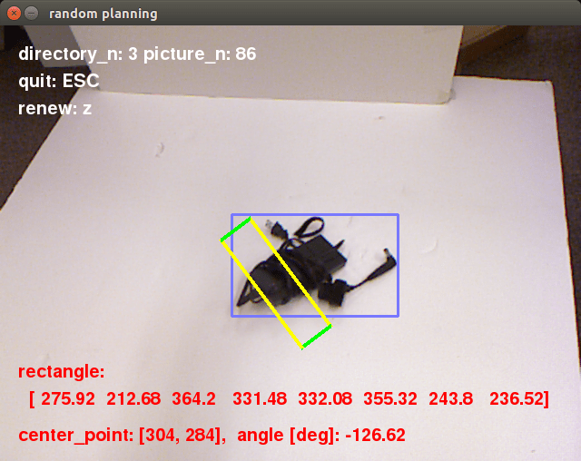

# grasp_planning

This repository is for the Robotic Grasp Planning Project using Neural Networks. Currently, `Cornell Grasping Dataset`(Robot Learning Lab, Computer Science Department, Cornell University) is used to train the neural networks.



## Environment

* Ubuntu 14.04

Please install the following softwares before using this repository.

* Python 2.7.6
* Chainer 1.19.0
* Pygame 1.9.1 release
* OpenCV (CV2) 2.4.8

## Usage

1. Create a new directory and `git clone` this repository.
```
$ mkdir -p robotic_grasp/grasp_dataset && cd robotic_grasp
$ git clone https://github.com/Nishida-Lab/grasp_planning.git
```
2. Download `Cornell Grasping Dataset` from following URL.  
http://pr.cs.cornell.edu/grasping/rect_data/data.php

3. Move each dataset to the directory `grasp_dataset` according to the directory structure.

## Directory Structure

```
robotic_grasp              <- the directory you created
    ├── grasp_dataset      <- Cornell Grasping Dataset
    │      ├── 01
    │      ├── 02 ... 10
    │      └── backgrounds
    └── grasp_planning     <- this repository
```

## Explanation of Cornell Grasping Dataset

Please read the document at following URL.  
http://pr.cs.cornell.edu/grasping/rect_data/readmeRawData.txt

## Note

### There are NaN data in the dataset

These two files in the dataset `01` contain some NaN data.

* pcd0132cpos.txt
* pcd0165cpos.txt

So please modify some files before you use them.

### How to delete NaN data

These two files contain the information of `Grasping Rectangle`. They contain 4 lines for each rectangle. Each line contains the x and y coordinate of a vertex of that rectangle separated by a space. So when you delete NaN data, you need to delete 4 lines to maintain the structure of rectangles. You can modify the files by copying contents below.

__pcd0132cpos.txt__

Raw data (before modification)
```
283 286.999 
284 315 
313 314 
312 285.999
270 288.92 
271 314 
296 313 
295 287.92
NaN NaN 
256 313 
277 313 
NaN NaN
NaN NaN 
236 314 
259 314 
NaN NaN
233 289.772 
236 316 
262 313 
259 286.772
```
↓ modify the file like this

After modification
```
283 286.999 
284 315 
313 314 
312 285.999
270 288.92 
271 314 
296 313 
295 287.92
233 289.772 
236 316 
262 313 
259 286.772
```

__pcd0165cpos.txt__

Raw data (before modification)
```
310 269.716 
313 301 
341 298 
338 266.716
281 269.267 
279 303 
300 304 
302 270.267
NaN NaN 
300 305 
321 305 
NaN NaN
```
↓ modify the file like this

After modification
```
310 269.716 
313 301 
341 298 
338 266.716
281 269.267 
279 303 
300 304 
302 270.267
```